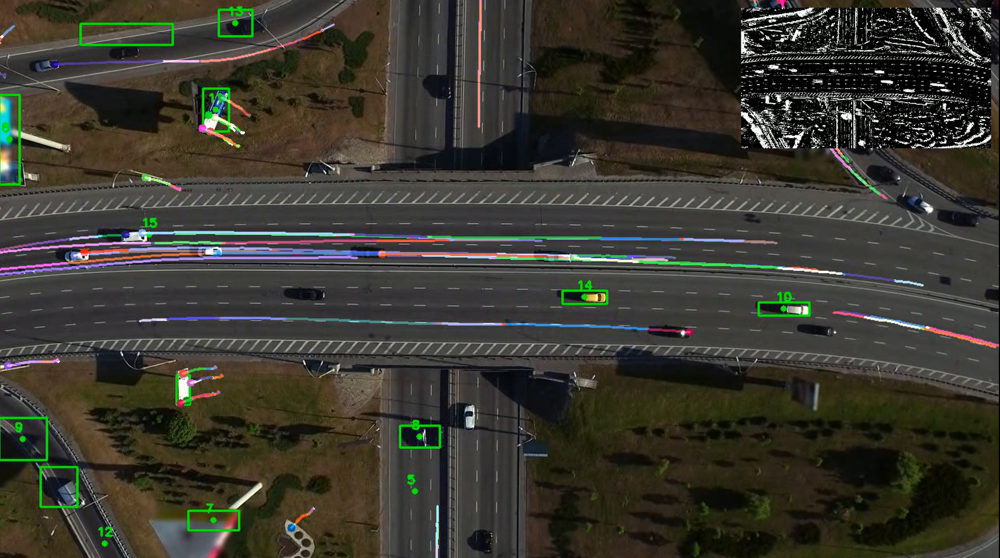

# Object Detection and Tracking with OpenCV

This project implements an object detection and tracking system using OpenCV in Python. It combines background subtraction, centroid-based tracking, and optical flow to detect and track moving objects in a video stream.



## Features

- Background subtraction using MOG2 or KNN methods
- Centroid-based object tracking with unique ID assignment
- Optical flow tracking for visualizing object movement
- Foreground mask overlay for visual feedback

## Requirements

````
pip install -r requirements.txt
````

## How it works

1. Background subtraction isolates moving objects from the static background.
2. Contour detection identifies potential objects.
3. Centroid tracking assigns and maintains unique IDs for detected objects.
4. Optical flow tracking visualizes the movement of feature points.